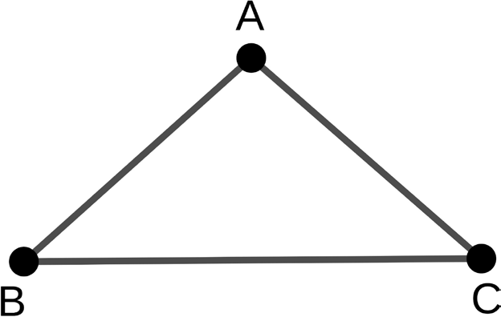
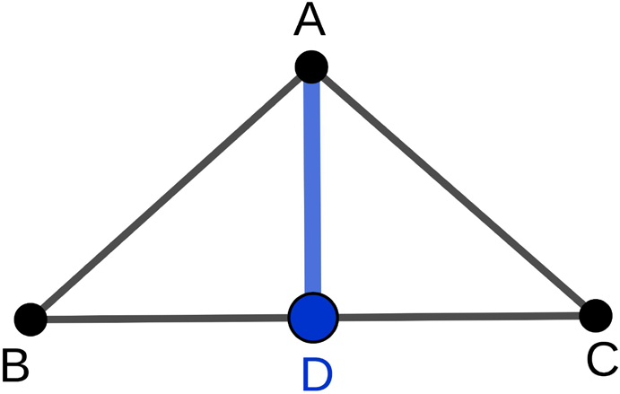
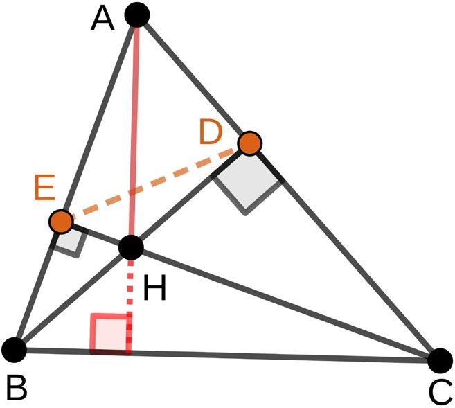
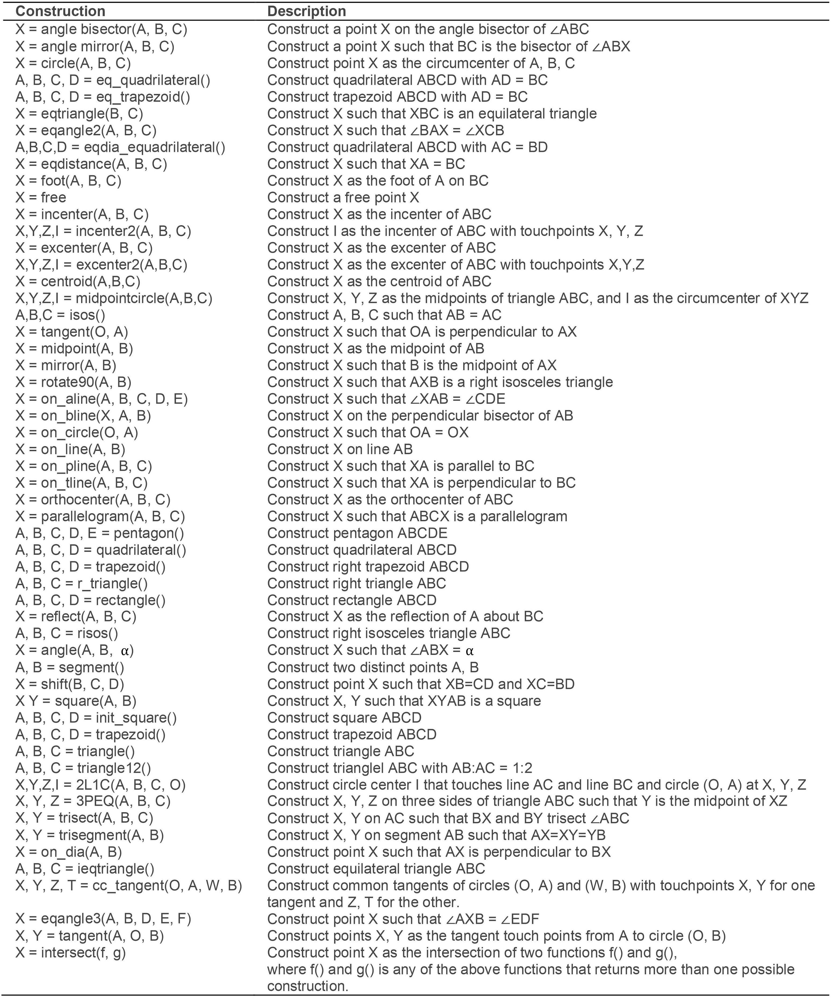
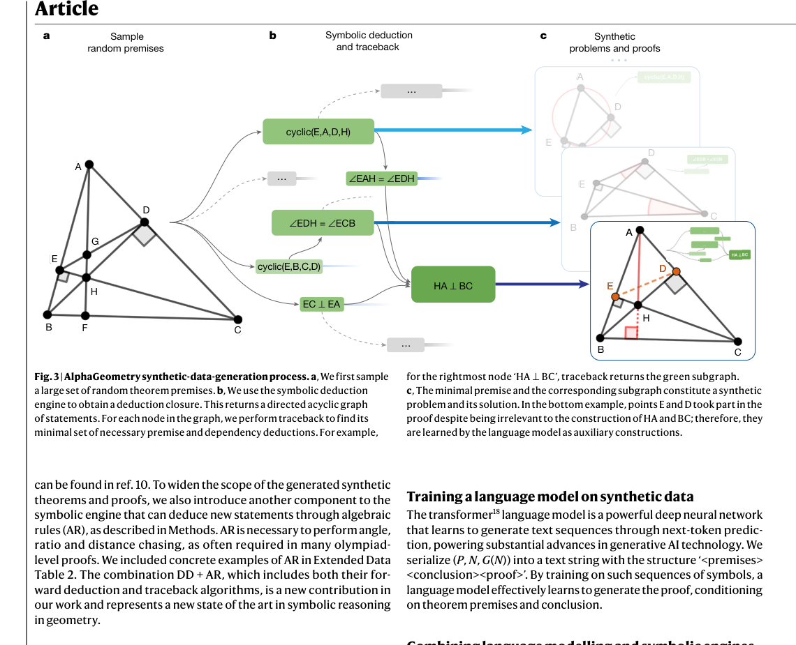
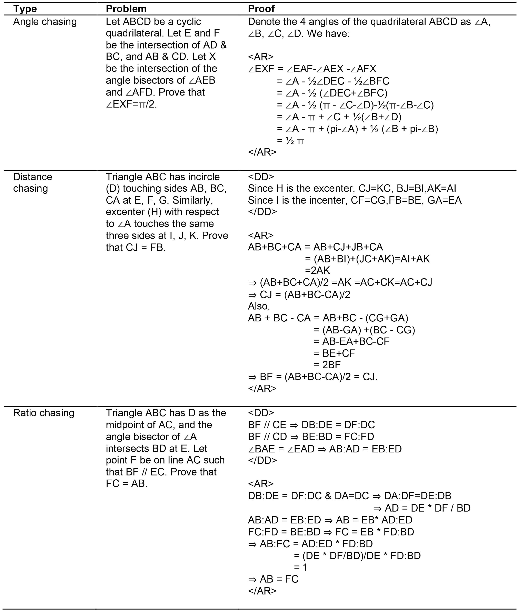
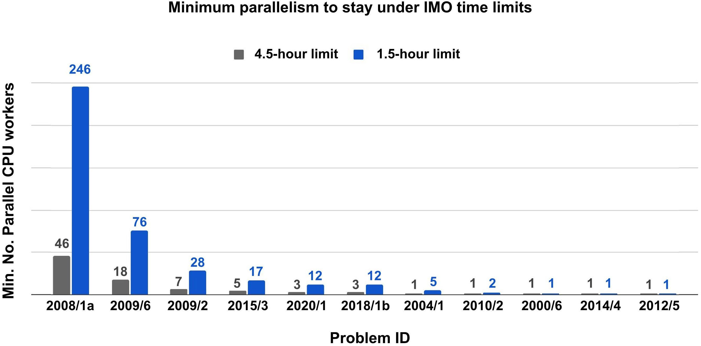
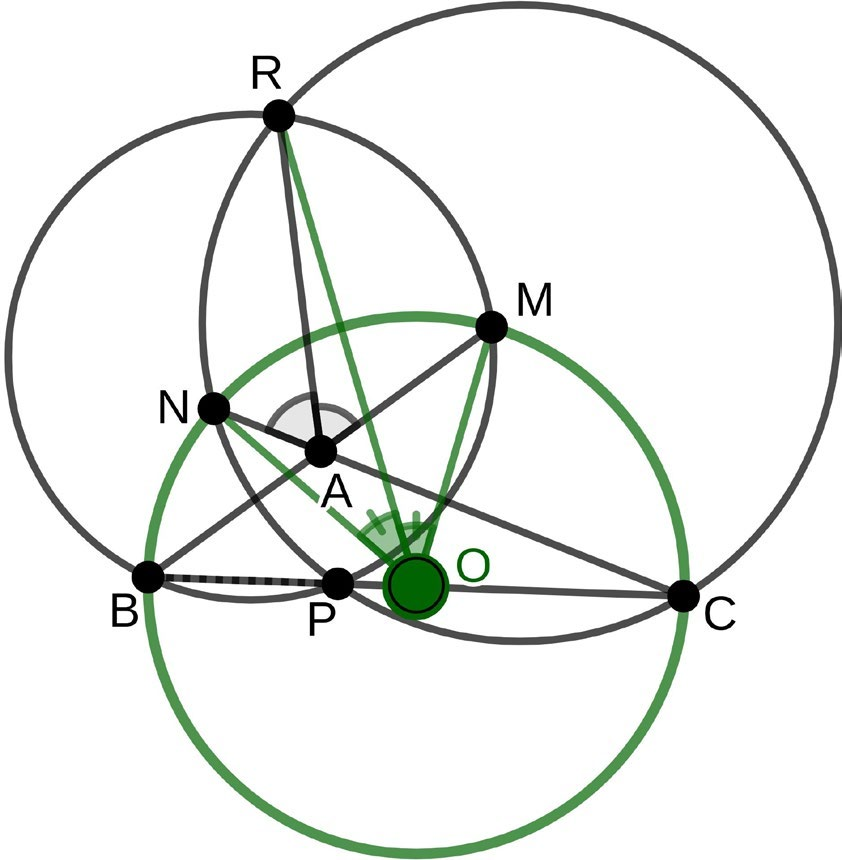
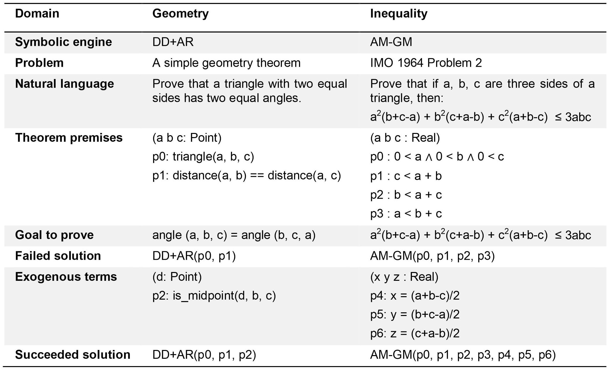
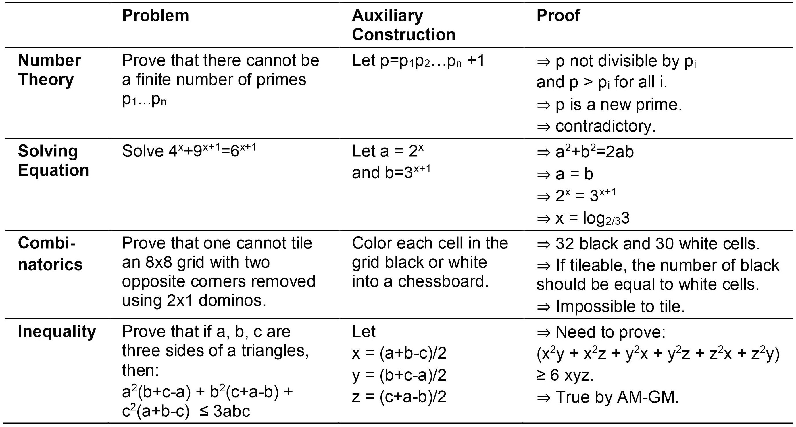

# AlphaGeometry (Nature 2024)

Paper: [Trinh et al., *Solving olympiad geometry without human demonstrations* (Nature, published online January 17, 2024)](https://www.nature.com/articles/s41586-023-06747-5).

## 1. Overview and Background

AlphaGeometry is a neuro-symbolic theorem prover for Euclidean plane geometry. It was designed for a setting where human-labeled formal geometry proofs are scarce.

The key idea is to avoid human demonstrations entirely:

1. Synthesize a very large geometry proof corpus from random but valid premises.
2. Train a language model on those synthetic theorem-proof pairs.
3. Use the trained model only for what symbolic systems struggle with: proposing auxiliary constructions.
4. Let symbolic engines do deterministic proof checking and deduction.

Main headline result: it solves 25/30 translated IMO geometry problems (IMO-AG-30), versus 10 for the prior SOTA Wu's method and 18 for the strongest symbolic+heuristic baseline.

## 2. What Geometry Environment Is Used?

AlphaGeometry does **not** operate in full general-purpose formal math languages (for example Lean). Instead, it uses a specialized geometry language/environment (in the line of GEX/JGEX/MMP/GeoLogic) that is narrow but efficient for classical Euclidean geometry.

Environment characteristics:

1. Objects and predicates are geometry-native (points, lines, circles, collinear, equal angles/segments, concyclic, etc.).
2. It includes non-degeneracy/topological assumptions typical in synthetic geometry systems.
3. Each proof step is checked in the system's logical and numerical semantics.
4. It was extended with integers/fractions/constants to support practical arithmetic inside geometry proofs.
5. Coverage is strong but limited: about 75% of IMO geometry problems can be translated into this environment.

Quick visual of the proof-search loop (simple problem before and after one auxiliary construction):

| Before auxiliary construction | After auxiliary construction |
| --- | --- |
|  |  |

Harder example context (from paper Fig. 1, IMO 2015 P3):

1. This is the **auxiliary-construction stage** of a hard proof, not the original clean problem diagram.
2. The highlighted added points here are `D` and `E` (orange in the paper figure); the full IMO 2015 P3 solution in the paper uses **three** auxiliary points.
3. These added objects give the symbolic engine new inputs (for example added right-angle/intersection relations), so DD+AR can expand its deduction closure and reach the conclusion.

## 3. Synthetic Data Generation

This is the central algorithmic contribution.

### 3.1 Step A: sample consistent random premises

The system uses a constructive diagram-builder language: rather than randomly asserting many unrelated facts (which causes contradictions), it incrementally constructs valid geometric objects/relations.

Examples include: adding midpoint/incenter/excenter points, constructing perpendiculars/parallels, reflections, tangencies, and ratio-constrained points.

Reference:

### 3.2 Step B: run symbolic deduction to build a DAG

Given sampled premises, the symbolic engine computes the **deduction closure**:

1. Nodes = all deduced true statements reachable from premises.
2. Edges = dependency links from each statement to immediate parent statements.

This forms a directed acyclic graph (DAG) of deductions.

For any target node `N` (candidate conclusion), traceback returns its dependency subgraph `G(N)`. Leaves of that subgraph are a subset `P` of premises actually needed for `N`.

So each synthetic theorem-proof item is:

`(premises, conclusion, proof) = (P, N, G(N))`

Main-paper Fig. 3 (synthetic-data-generation process):

1. **Panel a (left):** sample random but consistent premises by constructive geometry actions.
2. **Panel b (middle):** run symbolic deduction to build the closure graph (the DAG).  
Each green box is a deduced statement; arrows encode dependency links.
3. **Traceback step:** pick a target node, for example `HA ⟂ BC`, then traceback keeps only the minimal dependency subgraph that proves that node.
4. **Panel c (right):** the kept leaves are `P` (minimal premises), and the kept dependency graph is `G(N)`.  
Together they form one training triple `(P, N, G(N))`.
5. **Auxiliary-construction signal:** points like `E` and `D` can appear in the traced proof while not being part of the final target object set *(that is, the objects explicitly present in the theorem goal/conclusion, such as the points named in `N`)*; those are exactly the construction terms the LM learns to propose.

### 3.3 Step C: dependency difference -> auxiliary constructions

If a point/object is in the needed premise subset but is not part of the final conclusion's object set *(the objects explicitly mentioned in the conclusion statement)*, that "difference" is treated as auxiliary construction content.

This is critical:

1. Pure symbolic deduction alone can only derive what is already reachable from current objects.
2. Olympiad proofs often require introducing new objects.
3. These introduced objects are geometry's version of exogenous term generation (infinite branching challenge).

The challenge of "Infinite branching":

1. Suppose you need one extra point `X` to finish a proof.
2. `X` could be defined in many qualitatively different ways: midpoint, foot of a perpendicular, circle-line intersection, reflection, tangent point, etc.
3. Even inside one family (for example "pick `X` on line `BC`"), there are infinitely many numeric placements.
4. So unlike finite-action game search, theorem search can keep adding new terms without a fixed bound.
5. AlphaGeometry handles this by learning likely auxiliary constructions, then letting DD+AR verify/deduce from them.

By moving those construction steps into the synthetic proof, the language model can learn to generate them.

### 3.4 Step D: DD + AR integration

AlphaGeometry combines two deterministic engines with different jobs:

1. **DD (Deductive Database):** forward-rule deduction over symbolic geometry facts.
2. **AR (Algebraic Reasoning):** algebraic deduction over equalities (angles/ratios/distances).

What DD is doing (plain language):

1. DD stores facts like `collinear`, `parallel`, `perpendicular`, `concyclic`, equal angles/segments, etc.
2. It repeatedly applies rule templates of the form `Q(x) <- P1(x), ..., Pk(x)`.
3. Meaning: if all `P1...Pk` are already true, infer `Q`.
4. This rule form is what people call a **Horn clause** in logic programming.
5. Example form (illustrative): `perpendicular(AB,CD) <- perpendicular(AB,EF), parallel(EF,CD)`.

What "geometry equality" means in AR:

1. It means an equality between geometric quantities, such as:
   angle equality, ratio equality, distance/length equality, or slope equality.
2. The paper maps these to linear equations. Two explicit examples it gives:
   `∠ABC = ∠XYZ  ->  s(AB)-s(BC) = s(XY)-s(YZ)`
   `AB:CD = EF:GH  ->  log(AB)-log(CD) = log(EF)-log(GH)`
3. AR puts those equations into a coefficient matrix `A` and runs Gaussian elimination.
4. Constants such as `pi` and `1` are included as default variables when needed.

How DD and AR interact:

1. DD deduces new symbolic facts from current premises/rules.
2. Those facts are translated into equalities and added to AR.
3. AR deduces new equalities (for example angle/ratio consequences).
4. Those new equalities are fed back to DD as additional inputs.
5. This alternation repeats until no new statement appears (fixed-point closure).

How traceback is done:

1. DD side: find minimal dependency chains through transitivity structures (graphs/hypergraphs).
2. AR side: recover minimal parent equations via a mixed-integer linear program.

Reference examples for AR proofs:

### 3.5 Step E: prune proof graphs to minimal forms

Even if each deduction step has minimal immediate parents, the full traced proof can still contain globally unnecessary auxiliary points.

What they actually do:

1. Start from a successful proof that uses a set of auxiliary points.
2. Remove one subset of auxiliary points from the premises.
3. Re-run DD+AR on this reduced premise set.
4. Check **reachability**: can the target conclusion still be deduced?
5. If yes, keep the smaller set and continue pruning; if no, restore those points.
6. Repeat over subsets (the paper describes this as exhaustive trial-and-error) and keep the smallest proof that still reaches the goal.

Why this matters:

1. It removes vacuous constructions that appeared only through transitivity chains.
2. It makes synthetic training pairs cleaner, so the LM learns more meaningful construction patterns.
3. The same pruning idea is also applied after successful test-time proofs.

### 3.6 Scale and deduplication

Reported scale:

1. 100,000 CPU workers for 72 hours.
2. ~500M synthetic proof examples before dedup.
3. 100M unique theorem-proof examples after canonicalization/dedup.
4. 9M examples include at least one auxiliary construction.
5. No IMO-AG-30 leakage found in training set.

## 4. Model Structure and Training Using `(P, N, G(N))`

Training data is serialized as a sequence like:

`<premises><conclusion><proof>`

Definitions (self-contained):

1. `N`: one target conclusion statement chosen from the deduction graph (for example `HA ⟂ BC`).
2. `P`: the minimal subset of sampled premises needed to prove `N` after traceback.
3. `G(N)`: the traced dependency subgraph that proves `N` from `P` (this is the proof graph).

So the serialized triple is:

1. `<premises>` = `P`
2. `<conclusion>` = `N`
3. `<proof>` = `G(N)` (serialized as ordered proof steps)

Training setup:

1. Transformer (about 151M params, 12 layers).
2. Pretrain on all 100M synthetic proofs.
3. Fine-tune on the 9M auxiliary-construction subset to specialize search-time behavior.

Interpretation: the model is not trying to be an all-in-one prover; it mainly learns to propose useful auxiliary constructions compatible with DD+AR.

### Test-time proving loop

1. Start from problem statement.
2. Run DD+AR closure; if solved, stop.
3. If not solved, LM proposes auxiliary construction(s).
4. Add constructions, rerun DD+AR.
5. Repeat with beam search until solved or budget exhausted.

The paper's reported search parameters are aggressive but structured: beam size 512, max depth 16, decoding batch 32.

Parallelization details:

1. 4 GPU workers host LM replicas for beam decoding.
2. 10,000 CPU workers run symbolic solvers shared across beams/problems.
3. Resources are pooled so finished problems release workers to harder ones.

Parallelization figure from appendix:

Ablation figure (data size, beam size, depth, larger test set):

## 5. What the Model Learns and the Core Challenge It Addresses

Core challenge: **auxiliary construction** (exogenous term generation), i.e., creating new objects that make the theorem reachable.

What is learned:

1. Construction proposals that are useful under this specific symbolic engine.
2. Distribution over promising construction sequences conditioned on premises + goal.
3. Search priors that reduce branching pressure for hard geometry problems.

What is not learned well yet:

1. High-level human proof abstractions.
2. Short, elegant proof plans.
3. Techniques outside the environment's rule/tool set.

## 6. Results, Findings, and Contributions

### 6.1 Main benchmark table (IMO-AG-30)

| Method | Solved (out of 30) |
| --- | --- |
| Wu's method | 10 |
| Grobner basis | 4 |
| GPT-4 (natural-language proofs) | 0 |
| Full-angle method | 2 |
| DD | 7 |
| DD + human heuristics | 9 |
| DD + AR | 14 |
| DD + AR + GPT-4 constructions | 15 |
| DD + AR + human heuristics | 18 |
| **AlphaGeometry** | **25** |
| AlphaGeometry without pretraining | 21 |
| AlphaGeometry without fine-tuning | 23 |

### 6.2 Main findings

1. Integrating AR into DD gives a large symbolic jump (7 -> 14 solved).
2. LM-generated auxiliary constructions add another big jump (14 -> 25 solved).
3. With much smaller search/data budgets, it still remains strong (for example beam 8 or 20% data gives 21 solved).
4. It discovered a generalized form of translated IMO 2004 P1 by identifying an unnecessary premise through traceback.

Illustrative geometry from the generalized-theorem analysis:

### 6.3 Why this is a meaningful contribution

1. Shows end-to-end theorem proving gains from synthetic-data-first training.
2. Demonstrates a practical neural+symbolic division of labor.
3. Provides an explicit framework that can transfer in principle to other domains with exogenous-term challenges.

Appendix tables:

1. `Extended Data Table 3` shows the same pattern beyond geometry: hard problems often need an exogenous construction/term first, then a symbolic engine can finish the rest.
2. `Extended Data Table 4` gives a line-by-line analogy between geometry and inequality:
   same template = premises -> symbolic engine fails -> add auxiliary term(s) -> symbolic engine succeeds.
3. For this report, keep them as conceptual evidence that AlphaGeometry's "auxiliary construction + symbolic closure" design is a reusable algorithmic pattern, not only a geometry trick.
4. If you only care about IMO-AG-30 performance, these are secondary and can be skimmed.

## 7. Limitations

1. **Narrow representation:** AlphaGeometry targets synthetic Euclidean theorem proving in a specialized language; this scope intentionally excludes formulations that are primarily inequality- or counting-based.
2. **Geometric inequalities are out of scope:** simple example: for triangle sides \(a,b,c\), prove \(a^2(b+c-a)+b^2(c+a-b)+c^2(a+b-c)\le 3abc\) (the IMO 1964 P2 style in the appendix table). AlphaGeometry's DD+AR stack is built for geometric rule closure *(repeatedly apply geometry rules until no new fact can be deduced)* plus linear-equality deduction, not full inequality reasoning (for example AM-GM/Cauchy style proof steps).
3. **Combinatorial geometry is out of scope:** simple example: circle packing questions (for example, maximizing how many non-overlapping equal circles fit in a region). These require discrete counting/optimization over many configurations, while AlphaGeometry assumes a fixed geometric construction and proves symbolic consequences inside that construction.
4. **Tooling gap vs human proofs:** missing high-level tools (for example advanced coordinate tricks, some theorems) hurts hard problems.
5. **Proof readability:** outputs can be long, low-level, and less intuitive than human olympiad solutions.
6. **Synthetic-data mismatch:** random synthetic premises are broad, but still not guaranteed to cover required high-level lemmas for toughest IMO items.
7. **Compute footprint:** although much lighter than brute-force all-symbolic search, the full system still uses substantial parallel resources for best results.

## 8. Direct Answers to Your Specific Questions

### Q1) Does AlphaGeometry's environment have a proof-verification kernel like Lean?

Short answer: **no, not in the Lean/LCF sense**.

What AlphaGeometry verifies (concrete):

1. It uses a **specialized synthetic-geometry language** (GEX/JGEX/MMP/GeoLogic line), not a general proof language.
2. In that environment, each step is checked with logical + numerical consistency.
3. DD (deductive database) applies fixed Horn-clause geometry rules to build deduction closure.
4. AR (algebraic reasoning) converts angle/ratio/distance equalities into linear equations and runs Gaussian elimination to derive implied equalities.
5. DD and AR run alternately to a deterministic fixed point; traceback then extracts the dependency proof graph.

What it does **not** have versus Lean:

1. No small foundational trusted kernel (for example dependent type theory kernel).
2. No independent Lean-style kernel re-checking proof terms.
3. Narrow scope: a domain-specific Euclidean geometry formalism (paper reports ~75% IMO geometry translatable), not broad formal mathematics.

### Q2) How is search parallelization done?

1. LM side: beam search over alternative constructions (k branches), parallelized across GPU workers.
2. Symbolic side: each beam candidate is checked by DD+AR on large CPU worker pools.
3. Scheduler shares CPU workers across all problems; early-finished problems release resources to harder ones.
4. Reported setup: 4 GPU workers + 10,000 CPU workers for AlphaGeometry runs.

### Q3) Why not use a compute-heavy approach like TTRL in AlphaProof?

Short answer: AlphaGeometry is built for a narrower, stronger symbolic regime; AlphaProof+TTRL is a much heavier compute regime.

1. AlphaGeometry already has a strong domain-specific deterministic backend (DD+AR), so additional value comes from smarter constructions, not pure brute-force scaling alone.
2. The environment is narrower and more structured than broad formal-proof settings, making targeted beam+symbolic search efficient.
3. This is **not** because Euclidean geometry is \"easy\"; evidence is that several IMO problems remain unsolved due to missing high-level concepts/rules.
4. AlphaProof/TTRL-style heavy test-time compute makes more sense when the formal search space is broader and less directly constrained by a strong, specialized symbolic engine.

Compute comparison:

| System | Reported compute |
| --- | --- |
| AlphaGeometry | 100,000 CPU workers x 72 h for synthetic data (~300,000 CPU-days); LM training on a 4x4 TPUv3 slice; test-time search with 4 GPU workers + 10,000 CPU workers |
| AlphaProof (+ TTRL) | 100,000 TPU-days (training) + 80,000 TPU-days (TTRL) = **180,000 TPU-days** |

Money comparison:

1. In practice, **AlphaProof+TTRL costs more money**.
2. Even before counting AlphaGeometry's TPU/GPU usage, AlphaProof's 180,000 TPU-days are typically far more expensive than 300,000 CPU-days because TPU-day cost is much higher than CPU-day cost.
3. So the difference is not that Euclidean geometry is \"easy\"; it is that AlphaGeometry gets leverage from DD+AR in a constrained domain, while AlphaProof uses a broader formal-search setup where heavy compute pays off more.

(The rationale comparison above is an inference from the two systems' design goals and reported behavior.)
