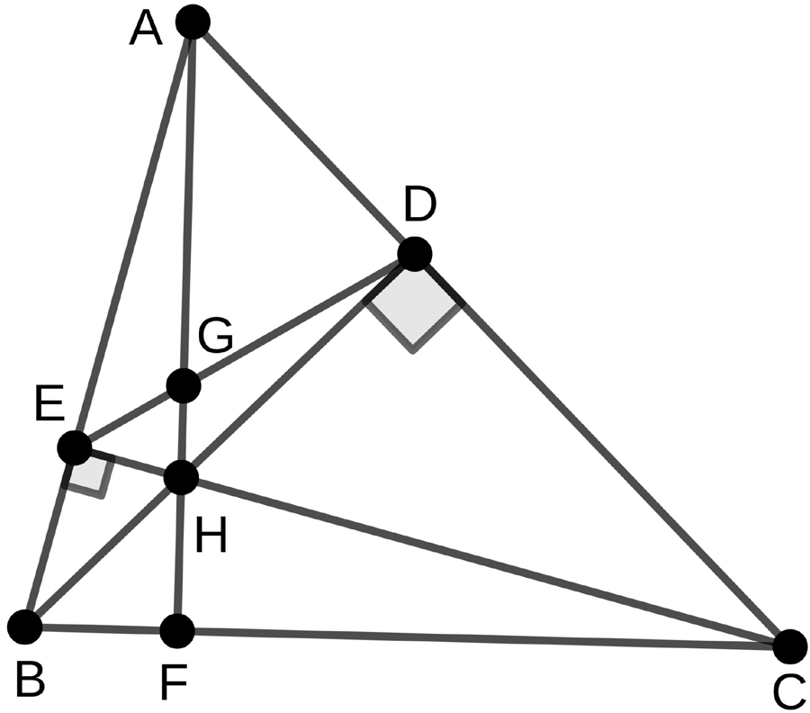

# AlphaGeometry (Nature 2024): Group-Meeting Briefing

Paper: Trinh et al., *Solving olympiad geometry without human demonstrations* (Nature, published online January 17, 2024).

## 1. Succinct Overview and Background

AlphaGeometry is a neuro-symbolic theorem prover for Euclidean plane geometry. It was designed for a setting where human-labeled formal geometry proofs are scarce.

The key idea is to avoid human demonstrations entirely:

1. Synthesize a very large geometry proof corpus from random but valid premises.
2. Train a language model on those synthetic theorem-proof pairs.
3. Use the trained model only for what symbolic systems struggle with: proposing auxiliary constructions.
4. Let symbolic engines do deterministic proof checking and deduction.

Main headline result: it solves 25/30 translated IMO geometry problems (IMO-AG-30), versus 10 for the prior SOTA Wu's method and 18 for the strongest symbolic+heuristic baseline.

## 2. What Geometry Environment Is Used?

AlphaGeometry does **not** operate in full general-purpose formal math languages (for example Lean). Instead, it uses a specialized geometry language/environment (in the line of GEX/JGEX/MMP/GeoLogic) that is narrow but efficient for classical Euclidean geometry.

Environment characteristics:

1. Objects and predicates are geometry-native (points, lines, circles, collinear, equal angles/segments, concyclic, etc.).
2. It includes non-degeneracy/topological assumptions typical in synthetic geometry systems.
3. Each proof step is checked in the system's logical and numerical semantics.
4. It was extended with integers/fractions/constants to support practical arithmetic inside geometry proofs.
5. Coverage is strong but limited: about 75% of IMO geometry problems can be translated into this environment.

Quick visual of the proof-search loop (simple problem before and after one auxiliary construction):

| Before auxiliary construction | After auxiliary construction |
| --- | --- |
|  |  |

Example of a much harder solved problem state:

## 3. Synthetic Data Generation (Detailed, Self-Contained)

This is the central algorithmic contribution.

### 3.1 Step A: sample consistent random premises

The system uses a constructive diagram-builder language: rather than randomly asserting many unrelated facts (which causes contradictions), it incrementally constructs valid geometric objects/relations.

Examples include: adding midpoint/incenter/excenter points, constructing perpendiculars/parallels, reflections, tangencies, and ratio-constrained points.

Reference (appendix extraction):

### 3.2 Step B: run symbolic deduction to build a DAG

Given sampled premises, the symbolic engine computes the **deduction closure**:

1. Nodes = all deduced true statements reachable from premises.
2. Edges = dependency links from each statement to immediate parent statements.

This forms a directed acyclic graph (DAG) of deductions.

For any target node `N` (candidate conclusion), traceback returns its dependency subgraph `G(N)`. Leaves of that subgraph are a subset `P` of premises actually needed for `N`.

So each synthetic theorem-proof item is:

`(premises, conclusion, proof) = (P, N, G(N))`

Main-paper Fig. 3 (synthetic-data-generation process):

### 3.3 Step C: dependency difference -> auxiliary constructions

If a point/object is in the needed premise subset but is not part of the final conclusion's object set, that "difference" is treated as auxiliary construction content.

This is critical:

1. Pure symbolic deduction alone can only derive what is already reachable from current objects.
2. Olympiad proofs often require introducing new objects.
3. These introduced objects are geometry's version of exogenous term generation (infinite branching challenge).

By moving those construction steps into the synthetic proof, the language model can learn to generate them.

### 3.4 Step D: DD + AR integration (appendix-heavy part)

AlphaGeometry combines two deterministic engines:

1. **DD (Deductive Database):** rule-based geometric deduction (Horn-clause style rules).
2. **AR (Algebraic Reasoning):** angle/ratio/distance chasing by converting equalities into linear equations and solving with Gaussian elimination.

How AR works at a high level:

1. Convert geometry equalities into linear forms over geometry variables.
2. Build coefficient matrix `A`.
3. Run Gaussian elimination to derive implied equalities exhaustively.
4. Include constants like `pi` and `1` as default variables.

How traceback is done:

1. For DD equalities: shortest dependency chains in transitivity graphs (or hypergraphs for collinearity/concyclicity).
2. For AR equalities: minimal-parent recovery as a mixed-integer linear program.

DD and AR run alternately until joint closure stops expanding.

Reference examples for AR proofs:

### 3.5 Step E: prune proof graphs to minimal forms

Even if each local step has minimal parents, global proof subgraphs can still contain unnecessary auxiliaries. They prune by trial removal of auxiliary subsets and re-running DD+AR to keep reachability, selecting the minimal proof variant found.

### 3.6 Scale and deduplication

Reported scale:

1. 100,000 CPU workers for 72 hours.
2. ~500M synthetic proof examples before dedup.
3. 100M unique theorem-proof examples after canonicalization/dedup.
4. 9M examples include at least one auxiliary construction.
5. No IMO-AG-30 leakage found in training set.

## 4. Model Structure and Training Using `(P, N, G(N))`

Training data is serialized as a sequence like:

`<premises><conclusion><proof>`

where proof corresponds to `G(N)`.

Training setup:

1. Transformer (about 151M params, 12 layers).
2. Pretrain on all 100M synthetic proofs.
3. Fine-tune on the 9M auxiliary-construction subset to specialize search-time behavior.

Interpretation: the model is not trying to be an all-in-one prover; it mainly learns to propose useful auxiliary constructions compatible with DD+AR.

### Test-time proving loop

1. Start from problem statement.
2. Run DD+AR closure; if solved, stop.
3. If not solved, LM proposes auxiliary construction(s).
4. Add constructions, rerun DD+AR.
5. Repeat with beam search until solved or budget exhausted.

The paper's reported search parameters are aggressive but structured: beam size 512, max depth 16, decoding batch 32.

Parallelization details:

1. 4 GPU workers host LM replicas for beam decoding.
2. 10,000 CPU workers run symbolic solvers shared across beams/problems.
3. Resources are pooled so finished problems release workers to harder ones.

Parallelization figure from appendix:

Ablation figure (data size, beam size, depth, larger test set):

## 5. What the Model Learns and the Core Challenge It Addresses

Core challenge: **auxiliary construction** (exogenous term generation), i.e., creating new objects that make the theorem reachable.

What is learned:

1. Construction proposals that are useful under this specific symbolic engine.
2. Distribution over promising construction sequences conditioned on premises + goal.
3. Search priors that reduce branching pressure for hard geometry problems.

What is not learned well yet:

1. High-level human proof abstractions.
2. Short, elegant proof plans.
3. Techniques outside the environment's rule/tool set.

## 6. Results, Findings, and Contributions

### 6.1 Main benchmark table (IMO-AG-30)

| Method | Solved (out of 30) |
| --- | --- |
| Wu's method | 10 |
| Grobner basis | 4 |
| GPT-4 (natural-language proofs) | 0 |
| Full-angle method | 2 |
| DD | 7 |
| DD + human heuristics | 9 |
| DD + AR | 14 |
| DD + AR + GPT-4 constructions | 15 |
| DD + AR + human heuristics | 18 |
| **AlphaGeometry** | **25** |
| AlphaGeometry without pretraining | 21 |
| AlphaGeometry without fine-tuning | 23 |

### 6.2 Main findings

1. Integrating AR into DD gives a large symbolic jump (7 -> 14 solved).
2. LM-generated auxiliary constructions add another big jump (14 -> 25 solved).
3. With much smaller search/data budgets, it still remains strong (for example beam 8 or 20% data gives 21 solved).
4. It discovered a generalized form of translated IMO 2004 P1 by identifying an unnecessary premise through traceback.

Illustrative geometry from the generalized-theorem analysis:

### 6.3 Why this is a meaningful contribution

1. Shows end-to-end theorem proving gains from synthetic-data-first training.
2. Demonstrates a practical neural+symbolic division of labor.
3. Provides an explicit framework that can transfer in principle to other domains with exogenous-term challenges.

Cross-domain framing from appendix:

## 7. Limitations

1. **Narrow representation:** only classical Euclidean geometry in a specialized language; geometric inequalities/combinatorial geometry are outside current scope.
2. **Tooling gap vs human proofs:** missing high-level tools (for example advanced coordinate tricks, some theorems) hurts hard problems.
3. **Proof readability:** outputs can be long, low-level, and less intuitive than human olympiad solutions.
4. **Synthetic-data mismatch:** random synthetic premises are broad, but still not guaranteed to cover required high-level lemmas for toughest IMO items.
5. **Compute footprint:** although much lighter than brute-force all-symbolic search, the full system still uses substantial parallel resources for best results.

## 8. Direct Answers to Your Specific Questions

### Q1) Does AlphaGeometry's environment have a proof-verification kernel like Lean?

Short answer: **it has a verification layer, but not a Lean-like general-purpose kernel**.

It verifies steps inside a domain-specific geometry environment (logical + numerical checks with DD+AR), but it is not the same as Lean's broad foundational kernel and expressivity.

### Q2) How is search parallelization done?

1. LM side: beam search over alternative constructions (k branches), parallelized across GPU workers.
2. Symbolic side: each beam candidate is checked by DD+AR on large CPU worker pools.
3. Scheduler shares CPU workers across all problems; early-finished problems release resources to harder ones.
4. Reported setup: 4 GPU workers + 10,000 CPU workers for AlphaGeometry runs.

### Q3) Why not use a compute-heavy approach like TTRL in AlphaProof?

The AlphaGeometry paper (2024) predates AlphaProof's 2025 TTRL results and is optimized for a different regime.

Pragmatic interpretation:

1. AlphaGeometry already has a strong domain-specific deterministic backend (DD+AR), so additional value comes from smarter constructions, not pure brute-force scaling alone.
2. The environment is narrower and more structured than broad formal-proof settings, making targeted beam+symbolic search efficient.
3. This is **not** because Euclidean geometry is "easy"; evidence is that several IMO problems remain unsolved due to missing high-level concepts/rules.
4. AlphaProof/TTRL-style heavy test-time compute makes more sense when the formal search space is broader and less directly constrained by a strong, specialized symbolic engine.

(That final comparison is an inference from the two systems' design goals and reported behavior.)
